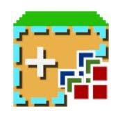
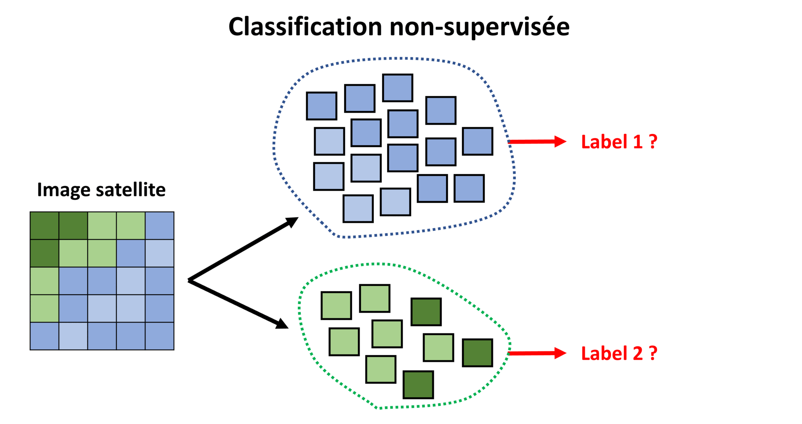
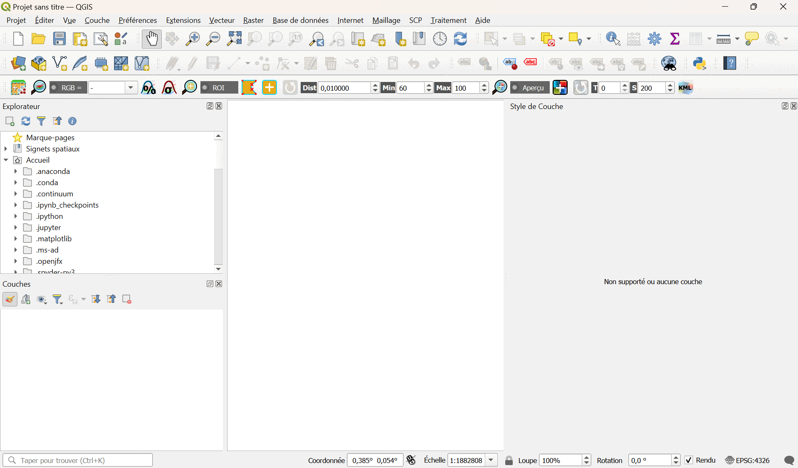
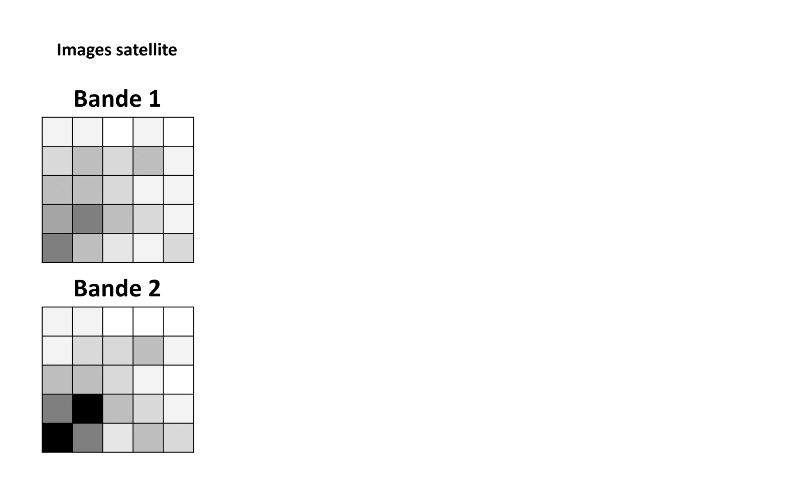
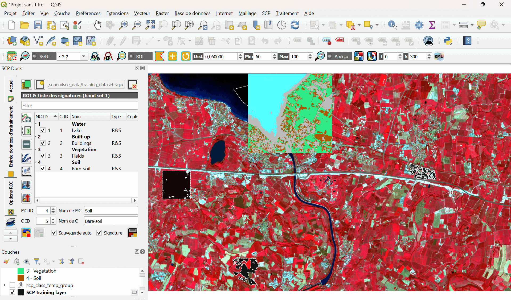

## La classification avec SCP

Cette partie du TD vous donnera les bases de la classification automatique avec QGIS (supervisée et non-supervisée) au travers de 2 exercices d'application à des données satellites.
Le plugin "Semi-Automatic Classification" (SCP), développé par Luca Congedo, sera utilisé ici.
L'idée est de vous donner les outils pour pouvoir classifier les pixels d'une image satellite (nuages, forêts, océans, ...) lors de votre projet.

---

### Introduction à la classification automatique

La classification des pixels d'une image satellite selon leur signature spectrale (i.e. les valeurs mesurées pour les différentes bandes d'observation) peut se faire de manière automatique. 
On appelle "classes" les différents groupes de pixels, et "labels" les étiquettes attribuées à chaque classe.
On peut diviser les méthodes de classification automatique en 2 grandes catégories :

* **Classification supervisée** : un modèle est entrainé à classifier les pixels d'une image en s'appuyant sur une base de données de référence, constituée de pixels dont les signatures spectrales sont déjà labélisées. 

* **Classification non-supervisée** : un algorithme regroupe les pixels d'une image dont la signature spectrale est la plus proche, et l'utilisateur devra labéliser lui-même ces groupes par la suite. On parle en anglais de "clustering" ("regroupement").

Les exercices suivants vous permettrons d'apprendre à utiliser le plugin SCP, afin de réaliser des classifications automatiques de pixel au sein d'images satellites multi-bandes.

---

### Exercice de classification non-supervisée

Les grandes étapes d'une classification non-supervisée de pixels dans une image satellite multi-bandes sont les suivantes :

1. Sélection des images et des bandes spectrales à analyser en fonction de la problématique.

2. Analyse des images par un algorithme, dont on définit les paramètres d'analyse : nombre de classes, nombre d'itérations, les bandes spectrales à utiliser, etc.

3. Identification des différentes classes (groupes de pixels) créées par l'algorithme.

Il existe différents algorithmes de classification non-supervisée. Nous utiliserons ici l'algorithme "k-means" (ou "k-moyennes").
Pour classer les pixels, l'algorithme se basera sur l'idée suivante : identifier les pics des différents histogrammes de l'image, et affecter les valeurs aux pics les plus proches. Les séparations entre classes tendent ainsi à se situer à mi-distance entre les pics.

La méthode k-means se déroule selon les étapes suivantes :

* Choix au hasard d'un point par classe (si l'utilisateur a choisi d'utiliser 4 classes, 4 points seront tirés au sort). Ces points constitueront le centre des classes.

* Chacun des autres points sont affectés au centre le plus proche : on constitue ainsi par exemple 4 classes.

* Les barycentres de chacune de ces classes sont calculés.

* Chaque point est affecté au centre le plus proche, et on recommence !

L'algorithme s'arrête quand les points ne changent plus de classes, ou quand le nombre d'itérations maximum est atteint.

Le nombre de classes est définit par l'utilisateur au moment de lancer l'algorithme. Le choix des points initiaux étant aléatoire, la méthode ne donnera exactement le même résultat si on la lance une 2ème fois avec les mêmes paramètres.
Lorque l'on a pas d'idée a-priori du nombre de classes à chercher, il est recommandé de lancer l'algorithme pour plusieurs nombres, et de sélectionner soi-même la meilleure classification. Des critères existent pour aider à réaliser ce choix.

La méthode k-means est connue pour sa rapidité et sa simplicité. Pour cette raison, elle est souvent la 1ère méthode utilisée en classification non-supervisée.

**Exercice :**

Nous allons appliquer la classification non-supervisée à l'image radiométrique multi-bandes "HOW15TM.tif" disponible dans le dossier "HOW15TM". On rappelle qu'il s'agit de données du satellite Landsat 8TM, prises au-dessus de la région de Worcester, dans le Massachusetts (USA).

* Cliquez dans la barre d'outils sur l'icone "Semi-Automatic Classification Plugin".

* Une fenêtre s'ouvre. Cliquez sur "Jeu de bandes", cliquez sur l'icone "Open a file", et ouvrez l'image multi-bande.

* Cliquez sur "Traitement de bande", puis sur "clustering".

* Vous pouvez alors modifier les paramètres de l'algorithme k-means, et lancer le processus en cliquant sur "Lancer".

* Une fenêtre s'ouvre, qui vous permettra de sauvegarder votre image "classifiée" en format TIF.

Si vous fermez la fenêtre, l'image classifiée est alors ouverte dans QGIS. Vous pouvez maintenant changer les étiquettes (labels) des différentes classes, voir en supprimer si elles sont inutiles.

---

### Exercice de classification supervisée

Comme expliqué précédemment, la classification supervisée se base sur un échantillon de pixels de référence labélisé par l'utilisateur.
Pour la labélisation de cet échantillon, il est possible de se baser sur une campagne de terrain avec des relevés d'occupation du sol, et/ou sur des bases de données autres (par exemple Corine Land Cover).
On parle souvent de "ground-truth" ("vérité terrain").

Les grandes étapes d'une classification supervisée de pixels dans une image satellite multi-bandes sont les suivantes :

1. Localisation de parcelles représentatives de chaque catégorie d'occupation du sol sur l'image. Ce seront les "parcelles d'entraînement".

2. Vectorisation des polygones autour de chaque parcelle, avec assignation d'un identifiant unique pour chaque classe d'occupation du sol.

3. Analyse des pixels inclus dans les parcelles d'entraînement et création d'un fichier de signatures spectrales pour chaque catégorie d'occupation du sol. Ce sera notre modèle de classification.

4. Classification de l'ensemble des pixels de l'image par comparaison de la signature spectrale de chacun par rapport à celle du fichier des signatures de référence.

Il existe de nombreux algorithmes de classification supervisée. Le plugin SCP propose les suivants :

* Maximum Likelihood

* Minimum Distance

* Multilayer Perceptron

* Random Forest

* Spectral Angle Mapping

* Support Vector Machine

Dans cet exercice, nous nous concentrerons sur les algorithmes "Minimum Distance" et "Maximum Likelihood" ("maximum de vraisemblance").
L'idée est dans les 2 cas de déterminer une frontière de décision entre classes, en modélisant la répartition des valeurs des pixels dans l'échantillon d'entrainement. 
C'est ce modèle qui nous servira à classifier des pixels hors de l'échantillon d'entrainement.
La différence est dans la manière de déterminer une frontière de décision :

* **Minimum Distance** va calculer la distance Euclidienne entre les valeurs d'un nouveau pixel et la moyenne des valeurs de chaque classe (déterminée à partir de l'échantillon d'entrainement). On attribura à ce pixel le label de la classe "la plus proche" au sens de cette distance.

* **Maximum Likelihood** va modéliser la distribution des valeurs des pixels de chaque classe par une loi normale (fonction Gaussienne). En se basant sur la formule de Bayes, la probabilité d'appartenance à chaque classe d'un nouveau pixel sera calculée. On attribura à ce pixel le label de la classe la plus probable.

Minimum Distance est plus rapide que Maximum Likelihood, mais il est en général moins performant, de part sa représentation sa modélisation simpliste de l'échantillon d'entrainement.

**Exercice :**

_Récupération des données :_

> Notre zone d'étude couvre une partie du lac de Garde dans le nord de l'Italie.
> Ces données sont issues du satellite Sentinel-2, elles sont déjà convertiesen réflectance et adaptées à la zone d'étude.
> Sentinel-2 est un satellite multi-spectral développé par l'Agence Spatiale Européenne (ESA) dans le cadre des services de surveillance des terres de Copernicus.
> Sentinel-2 acquiert 13 bandes spectrales avec une résolution spatiale de 10 à 60 m selon la bande, comme illustré dans ce tableau :

|Bande|Cible                  |Longueur d'onde centrale (µm)|Résolution (m)|
|:----|:---------------------:|:---------------------------:|-------------:|
|1    |Aerosols côtiers       |0.443                        |60            |
|2    |Bleu                   |0.490                        |10            |
|3    |Vert                   |0.560                        |10            |
|4    |Rouge                  |0.665                        |10            |
|5    |Végétation "red-edge"  |0.705                        |20            |
|6    |Végétation "red-edge"  |0.740                        |20            |
|7    |Végétation "red-edge"  |0.783                        |20            |
|8    |Proche infrarouge (NIR)|0.842                        |10            |
|8A   |Végétation "red-edge"  |0.865                        |20            |
|9    |Vapeur d'eau           |0.945                        |60            |
|10   |SWIR-Cirrus            |1.375                        |60            |
|11   |SWIR                   |1.610                        |20            |
|12   |SWIR                   |2.190                        |20            |

> Vous pouvez récupérer ces données dans le dossier "SCP_supervisee_data".

_Définition du "Jeu de bandes" :_

> Tout d'abord, nous devons définir le "jeu de bandes" qui est l'image d'entrée pour la classification.

> * Cliquez dans la barre d'outils sur l'icone "Semi-Automatic Classification Plugin".

> * Une fenêtre s'ouvre. Cliquez sur "Jeu de bandes", cliquez sur l'icone "Open a file", et ouvrez les fichiers TIF correspondant aux 10 bandes de l'image.

> * Dans la même fenêtre, allez dans la section "Band quick settings", et sélectionnez dans "wavelength" les bandes de "Sentinel-2". Ainsi, les noms des bandes seront dans le bon ordre, avec la bonne fréquence centrale.

> * Vous pouvez maintenant afficher une image composite de bandes de couleurs proche-infrarouge / rouge / vert. Dans la même fenêtre, sélectionnez les bandes ajoutées dans la "Band set table", puis cliquez sur le bouton "RGB". L'image composite s'affiche alors sur la page principale de QGIS.

> * Vous pouvez modifier les bandes utilisées pour les couleurs en cliquant sur la liste "RGB" dans la barre d'outils. Vous pouvez sélectionner "7-3-2" pour proche infrarouge / rouge / vert, et "3-2-1" pour rouge / vert / bleu.

_Sélection des "ROI" :_

> Nous allons à présent créer des "ROI" ("Region Of Interest"), définissant des "Classes" et des "Macroclasses".
> SCP permet en effet de définir 2 niveaux de classifications :

> **Classe :** groupe de pixels ayant une signature spectrale similaire, associée a un type d'occupation du sol ("arbres", "herbe", "bâtiments" ou "routes" par exemple). On leur associe un "C ID".
> **Macroclasse :** groupe de ROI contenant différentes classes, mais que l'on veut ranger ensemble pour l'étude ("végétation" contenant "arbres" et "herbe", "artificiel" contenant "bâtiments et "routes" par exemple). On leur associe un "MC ID".

> Une macroclasse étant composée de matériaux ayant des signatures spectrales différentes, pour obtenir de bons résultats en classification nous devons séparer les matériaux même s'ils appartiennent à la même macroclasse.
> Nous allons donc créer plusieurs ROI pour chaque macroclasse, en attribuant un C ID différent à chaque ROI.

> Nous allons utiliser les MC ID suivant :

|Macroclasse|MC ID|
|:----------|----:|
|Water      |1    |
|Built-up   |2    |
|Vegetation |3    |
|Soil       |4    |

> Il y a 2 méthodes pour sélectionner des ROI : dessiner manuellement un polygone ou utiliser un algorithme d'agrandissement automatique de la région.

> Nous allons commencer par sélectionner un polygone manuellement pour la macroclasse "Water" :

> * Si le panneau "SCP Dock" n'est pas déjà ouvert dans QGIS, dans le menu, cliquez sur "SCP", puis sur "Show plugin".

> * Dans le panneau "SCP Dock", cliquez sur "Entrée données d'entrainement". Créez un nouveau fichier de données d'entrainement en cliquant sur "Create a new training input". Donnez-lui un nom, et cliquez sur "Enregistrer".

> * Dans la barre d'outils SCP, cliquez sur l'icone "Create a ROI polygon". Trouvez une portion de l'image correspondant au lac. Tracez votre polygone sur l'image en faisant des clics gauche au niveau des sommets. Faites un clic droit pour fermer le polygone.

> * Un polygone orange apparait alors. Il s'agit d'un polygone temporaire (pas encore enregistré dans les données d'entrainement). Si vous tracez un nouveau polygone temporaire, le précédent sera alors remplacé.

> * Pour enregistrer ce polygone dans les données d'entrainement, dans le "SCP Dock" / "Entrée données d'entrainement" / "ROI & Liste des signatures", définissez MC ID = 1, Nom de MC = Water, C ID  = 1 et Nom de C = Lake. Cliquez alors sur l'icone "Save temporary ROI to training input".

> * La ROI apparait alors dans la liste. Vous pouvez modifier sa couleur si besoin.

> Nous allons à présent utiliser l'algorithme d'agrandissement automatique pour la macroclasse "Built-up" :

> * Dans la barre d'outils SCP, il y a un paramètre "Dist" qui doit être définit en fonction de la plage de valeurs des pixels. De manière générale, augmenter "Dist" crée des ROI plus grandes. Nous proposons de paramétrer "Dist" à 0,06.

> * Dans la barre d'outils SCP, cliquez sur l'icone "Activate ROI pointer". Trouvez une portion de l'image correspondant à des batiments (en bleu clair en RGB=7-3-2). Cliquez sur un pixel correspondant à un batiment.

> * Un polygone orange apparait alors. Il s'agit encore une fois d'un polygone temporaire (pas encore enregistré dans les données d'entrainement). Si vous générez un nouveau polygone temporaire, le précédent sera alors remplacé.

> * Pour enregistrer ce polygone dans les données d'entrainement, dans le "SCP Dock" / "Entrée données d'entrainement" / "ROI & Liste des signatures", définissez MC ID = 2, Nom de MC = Built-up, C ID  = 2 et Nom de C = Buildings. Cliquez alors sur l'icone "Save temporary ROI to training input".

> * La ROI apparait alors dans la liste. Vous pouvez modifier sa couleur si besoin.

> * Créez de la même façon une ROI pour la macroclasse "Vegetation" (pixels rouge en RGB=7-3-2) et une ROI pour la macroclasse "Soil" (pixels jaunâtres en RGB=7-3-2).

> * Vous pouvez afficher les signatures spectrales des ROI en les sélectionnant puis en cliquant sur l'icone "Add highlighted signatures to spectral signature plot" (dans "SCP Dock" / "Entrée données d'entrainement").

_Création d'une classification "preview" :_

> Il peut être utile de créer un aperçu de la classification sur un morceau de l'image, afin d'évaluer les performances avant la classification de la totalité de l'image.
> Si les résultats ne sont pas bons, nous pouvons collecter des ROI supplémentaires.

> Avant un aperçu (ou une classification de toute l'image), n'oubliez pas de définir les couleurs de différentes classes / macroclasses.

> Nous allons donc réaliser un aperçu de notre modèle de classification :

> * Dans le barre d'outils SCP, cliquez sur l'icone "Semi-Automatic Classification Plugin".

> * Dans la fenêtre qui s'ouvre, allez dans "Traitement de bande", puis dans "Classification".

> * Vérifiez que le jeu de bandes sélectionné est le bon. Cochez "Macroclass ID" ou "Class ID" suivant la classification que vous souhaitez faire. Sélectionnez "Maximum de vraisemblance" (Maximum Likelihood) comme algorithme.

> * Dans la barre d'outils SCP, définissez le paramètre "Set" ("Set the preview size") à 300 pixels.

> * Toujours dans la barre d'outils SCP, cliquez sur l'icone "Activate classification preview pointer". Cliquez ensuite où vous voulez sur l'image.

> * La classification apparait pour un carré de 300x300 pixels, centré là où vous avez cliqué.

> La classification obtenue est probablement moyennement performante. Vous pouvez alors modifier les ROI utilisées pour l'entrainement : en retirer ou en ajouter de nouvelles.

_Création de la classification totale :_

> En partant du principe que nous sommes satisfaits des performances du modèle de classification, nous allons procéder à la classification totale de l'image :

> * Dans la barre d'outils SCP, cliquez à nouveau sur l'icone "Semi-Automatic Classification".

> * Dans la fenêtre qui s'ouvre, allez dans "Traitement de bande", puis dans "Classification". 

> * Cette fois-ci, cliquez sur le bouton "Lancer" ("Run").

> * Une fenêtre s'ouvre, vous permettant d'enregistrer la classification au format TIF.

> * Une fois que vous aurez cliqué sur "Enregistrer", l'image entièrement classifiée s'ouvrira dans QGIS.

Nous vous recommandons d'utiliser la couche OpenStreetMap pour sélectionner les ROI avant une classification, et pour juger des performances d'un modèle de classification.
Refaites cet exemple avec plus de classes en vous basant sur OpenStreetMap.