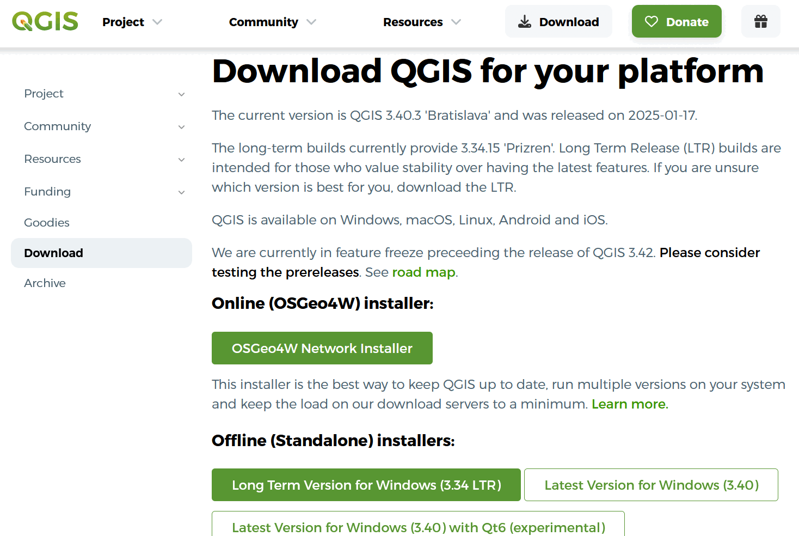
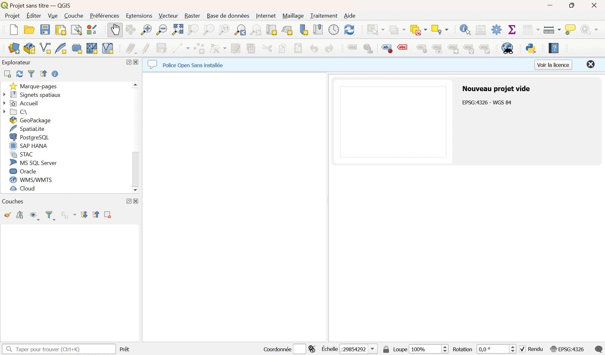
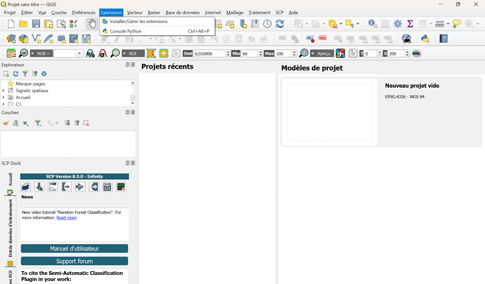

## Préparation du TD

Il y a 3 pré-requis à ce TD :

* L'installation de QGIS.

* L'installation du plugin SCP.

* Le téléchargement des données des exercices.

Cette partie du TD vous permettra de faire les 3, dans l'idéal en amont du TD.

---

### Installation de QGIS

QGIS est un logiciel libre de SIG (Système d'Information Géographique).

Vous pouvez télécharger la dernière version de QGIS avec le lien suivant : [https://qgis.org/download](https://qgis.org/download)

---

### Installation du plugin SCP

SCP (Semi-automatic Classification Plugin) est un plugin open-source de QGIS, contenant des outils pour de la classification d'images provenant d'applications de remote-sensing.

Vous trouverez la documentation du plugin SCP sur le lien suivant : [https://semiautomaticclassificationmanual.readthedocs.io/en/latest/index.html](https://semiautomaticclassificationmanual.readthedocs.io/en/latest/index.html)

Pour installer le plugin sous QGIS :

* Cliquez sur l'onglet "Extensions".

* Cliquez sur "Installer/Gérer les extensions".

* Dans la fenêtre qui apparait, rechercher "SCP".

* Sélectionner "Semi-automatic Classification Plugin".

* Cliquez sur "Installer l'extension".

De nouveaux onglets sont à présent disponibles dans QGIS.

**La classification non-supervisée n'est plus disponible dans la dernière version de SCP.**

Afin de contourner ce problème, vous pouvez installer dans un 2nd temps la version 7 du plugin.

Pour installer SCP version 7 :

* Cliquez sur l'onglet "Extensions".

* Cliquez sur "Installer/Gérer les extensions".

* Dans la fenêtre qui apparait, cliquez sur "Paramètres".

* Cliquez sur "Ajouter".

* Dans la fenêtre qui apparait, remplir la section "Nom" avec "SCP", et la section "URL" avec "https://semiautomaticgit.github.io/SemiAutomaticClassificationPlugin_v7/repository.xml".

* Cliquez sur OK.

* Dans la fenêtre, aller dans la section "Toutes".

* Sélectionnez la version 7 du plugin et cliquez sur "Installer l'extension".

---

### Récupération des données du TD

Les données dont vous aurez besoin pour votre projet sont en général téléchargeables gratuitements sur un des sites suivants :

* [Portail européen EUMETSAT](https://view.eumetsat.int/productviewer?v=default#)

* [Portail américain Worldview](https://worldview.earthdata.nasa.gov)

* [Programme européen Copernicus](https://browser.dataspace.copernicus.eu)

* [Portail américain du USGS EarthExplorer](https://earthexplorer.usgs.gov)

Les données du TD sont disponibles dans 4 dossiers :

* SCP_supervisee_data

* HOW15TM

* S2B_MSIL2A_20231215T112359_N0510_R037_T30UVU_20231215T130705.SAFE

* Venice

Vous utiliserez lors de ce TD 2 types de données :

* Type **raster** : image matricielle avec plusieurs bandes spectrales.

* Type **vectoriel** : SIG avec différentes couches d'information.