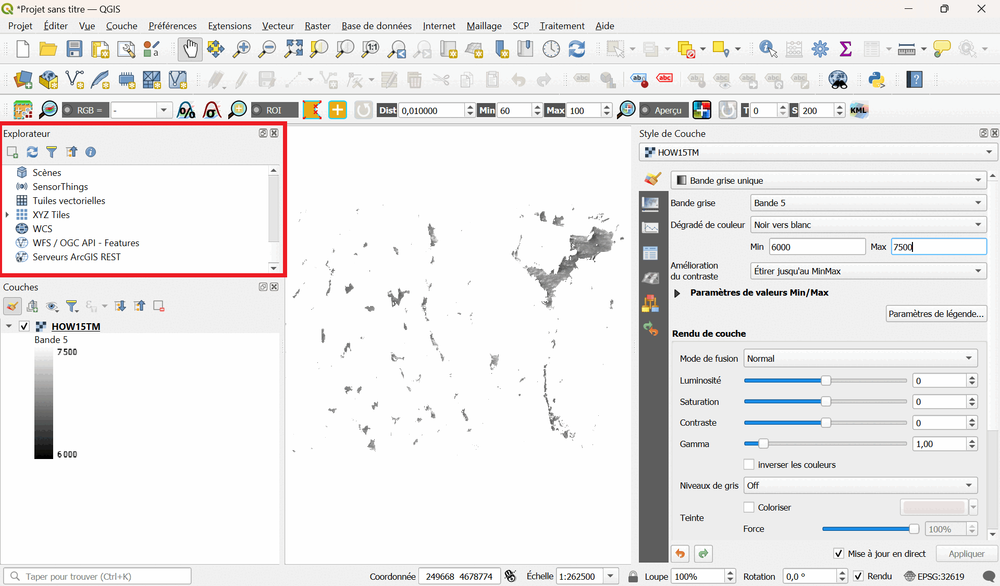

## Prise en main de QGIS

Cette partie du TD vous permettra de prendre en main QGIS, avec 3 exercices d'analyse d'images satellite.
L'idée est ici est de vous donner les bases nécessaires à l'utilisation de QGIS dans le cadre de votre projet.

---

### Démarrer QGIS

Lorsque démarrez QGIS, la fenêtre suivante s'ouvre : 

Les éléments identifiés sur cette fenêtre sont :

1. La barre de menu

2. Les barres d'outils

3. Le panneau de l'explorateur de fichiers

4. Le panneau des couches du GIS

5. Le canevas de la carte

6. La barre d'état

Le panneau des couches vous permettra à tout moment de voir les couches disponibles dans le projet.

Dérouler les boutons à options (en cliquant sur la petite flèche juste à côté du bouton) vous donnera les différentes fonctions de ses options.

---

### Analyse d'une image

Commençons par l'analyse de l'image radar "Venice_Envisat_ASAR.tif" disponible dans le dossier "Venice". Ces données du satellite [ENVISAT](https://earth.esa.int/eogateway/missions/envisat) ont été prises au-dessus de Venise en Italie.

Vous pouvez tout simplement glisser l'image dans la fenêtre du logiciel.
Vous obtenez quelques informations de base : nom de la couche, type de géométrie, système de référence des coordonnées et le chemin complet de l'emplacement sur votre appareil.

Pour obtenir plus d'informations, et pour modifier la façon dont l'image s'affiche, cliquez sur l'icone "Style de couche" :

**Exercice :**

* Analysez l'image affichée. Que représente-t-elle ?

* Changez l'échelle de la carte.

* Utilisez la rotation de l'image.

* Quelle est la projection utilisée ?

* A quoi sert l'icone "i" avec une flèche ? Que représente alors le tableau qui apparait en cliquant sur un pixel de l'image (après avoir cliqué sur cette icone) ?

---

### Analyse d'une image multispectrale

Nous allons à présent analyser l'image radiométrique "Venice_Landsat_ETM_multispectral.tif" disponible dans le dossier "Venice". Ces données ont également été prises au-dessus de Venise en Italie, mais par un satellite [Landsat](https://landsat.gsfc.nasa.gov).

Comme pour l'exercice précédent, vous pouvez tout simplement glisser l'image dans la fenêtre du logiciel.
Qu'observez-vous ?

Pour accéder aux propriétés des différentes couches, double-cliquez sur elles dans l'onglet "Couches". Une fenêtre apparaitra. Cliquez sur la section "Information". Combien de bandes sont disponibles ? Que représentent-elles ?

Vous pouvez également modifier les paramètres d'affichage grâce à l'onglet "Style de Couche". Vous pouvez afficher l'image en "Couleur à bandes multiples", "Bande grise unique", et jouer sur les différents autres paramètres. Qu'observez-vous dans chaque cas ?

**Exercice :**

* Isolez la bande 5 en la séléctionnant dans l'onglet "Style de Couche", paramètre "Bande grise".

* Ajoutez un fichier "shapefile" en ouvrant le fichier "places_UTM_Venice2.shp" contenu dans le sous-dossier "Venice_UTM_subset". Pour ce faire, dans le menu cliquez sur "Couche", puis sur "Ajouter une couche", puis sur "Ajouter une couche vecteur". Une fenêtre s'ouvrira, qui vous permettra de sélectionner le fichier à importer.

* Une fois la nouvelle couche ajoutée, cliquez sur le symbole "Etiquettes" dans l'onglet "Style de Couche", et sélectionnez "Etiquettes simples".

* Vous pouvez adapter la couleur des puces et des étiquettes.

* Reprennez l'étape précédente, et ouvrez successivement les fichiers suivants : landuse_UTM_Venice.shp, roads_UTM_Venice.shp, railways_UTM_Venice.shp, natural_UTM_Venice.shp, waterways_UTM_Venice.shp. Vous pouvez visualiser toutes les couches, les éditer, en ajouter ou les supprimer. Comme précédemment, interprétez toutes les données de ces nouvelles couches d'informations.

* Analysez les shapefiles en utilisant le "gestionnaire BD" : cliquez sur "Base de données" dans le menu, puis cliquez sur "DB manager". Une fenêtre s'ouvrira, qui vous permettra de sélectionner la couche du projet que vous voulez analyser.

---

### Manipulation de plusieurs bandes spectrales

Nous allons pour finir analyser l'image radiométrique multi-bandes "HOW15TM.tif" disponible dans le dossier "HOW15TM". Il s'agit de données du satellite [Landsat 8TM](https://landsat.gsfc.nasa.gov/satellites/landsat-8), prises au-dessus de la région de Worcester, dans le Massachusetts (USA).

Vous pouvez une fois de plus glisser l'image dans la fenêtre du logiciel.
Qu'observez-vous ?

De la même manière que pour l'exercice précédent, isolez la bande 3 en nuances de gris. Qu'observez-vous à présent ?

Tracez l'histogramme de l'image : double-cliquez sur la couche correspondante, et dans la fenêtre qui s'ouvre, cliquez sur "Histogramme". Que voyez-vous ?
L'histogramme est la fréquence des pixels en fonction de leur valeur. Et plus la valeur des pixels est haute, plus la réflectance est élevée.
Focalisons-nous sur l'histogramme de la bande 3. Cliquez sur "Préférences/Actions", et cliquez sur "Afficher la bande sélectionnée". 
On observe une distribution bimodiale : 2 pics sont clairement visibles dans l'histogramme.

**Exercice :**

Maintenant que nous avons affiché l'histogramme de la bande 3 :

* Définissez la plage de données optimale. Vous pouvez zoomer sur l'histogramme en cliquant dessus avec la loupe.

* Adaptez les valeurs min/max (en entrant les valeurs ou en les sélectionnant directement sur le graphique), et cliquez sur "Appliquer". Qu'observez-vous au niveau de l'image ?

* Déterminez les valeurs caractéristiques des 2 pics de l'histogramme. A quelles catégories de l'image pouvez-vous les attribuer ? L'identification est-elle facile ?

* Ouvrir successivement les autres bandes spectrales, et tracer de la même manière les histogrammes en essayant d'identifier les pics. Que constatez-vous ?

Pour aider à l'identification des catégories de l'image correspondant aux pics, nous allons afficher un fond :

* Allez dans le panneau "Explorateur", puis allez sur "XYZ Tiles", et double-cliquez sur "OpenStreetMap". Une carte s'affiche.

* Alternez l'affichage entre les 2 couches disponibles, pour associer les zones claires / sombres de la bande choisie avec la carte. Vous pouvez aussi jouer sur la transparence de chaque couche.

Chaque bande spectrale contient des informations, plus ou moins intéressantes suivant les catégories à analyser. Avec QGIS, il est possible d'analyser plusieurs bandes spectrales en même temps. Pour cela, il faut combiner plusieurs bandes spectracles et faire une "composition colorée".

Voici comment créer une composition colorée de type "RGB" (Red, Green and Blue) :

* Dans le panneau "Style de Couches" (pour la couche HOW15TM), dans la catégorie "Symbologie", de la même manière que vous aviez sélectionné "Bande grise unique" précedemment, sélectionnez "Couleur à bandes multiples".

* Choisir les bonnes bandes pour les bonnes couleurs, en vous basant sur ce tableau suivant, qui décrit les bandes d'observation du satellite Landsat 8TM :

|Bande|Cible                  |Longueur d'onde (µm)|
|:----|:---------------------:|-------------------:|
|1    |Aerosols côtiers       |0.43-0.45           |
|2    |Bleu                   |0.45-0.51           |
|3    |Vert                   |0.53-0.59           |
|4    |Rouge                  |0.64-0.67           |
|5    |Proche infrarouge (NIR)|0.85-0.88           |

(La résolution au sol de chaque bande est de 30 m).

Notez que l'on n'utile pas ici la bande 1. La bande bleue du visible correspond ici à la bande 2, ce qui décale les affectations de couleurs. C'est ce que l'on appelle une "composition colorée en vraies couleurs" (True Color Composite).

* Affichez les informations de l'image et les commenter.

* Interpréter cette nouvelle image RGB et enregister le résultat sous le nom "HOW15TCC", en utilisant par exemple : dans le menu "Projet", cliquez sur "Importer/Exporter", puis sur "Exporter la carte au format image". Une fenêtre s'ouvrira qui vous permettra de paramétrer votre export.

Maintenant que vous associez les bonnes couleurs aux bandes, analysez de nouveau les histogrammes :

* A quoi correspondent les différents pics ?

* Vous pouvez à nouveau utiliser l'icone "Identifier des entités" de la barre d'outils, et cliquer à différents endroits de l'image pour obtenir les valeurs de chaque bande.

* Analysez les différentes zones composant l'image (eau, ville, forêt, etc.) et reliez ces informations aux bandes utilisées.

Dans la région d'où proviennent ces données, les bandes rouge, vert et proche infrarouge concentrent l'essentiel de l'information utile.
Nous allons de nouveau faire une composition colorée de type RGB, mais avec ces 3 bandes.
C'est ce que l'on appelle une composition colorée en "fausses couleurs" (False Color Composite).

* Remplacez la bande bleue par la bande du proche infrarouge.

* Enregistrez le résultat de l'image RGB sous le nom "HOW15FCC".

* Interprétez cette nouvelle composition colorée en fausses couleurs.

* Tracez l'histogramme et comparer les 3 bandes spectrales utilisées pour les différentes catégories d'occupation du sol.

