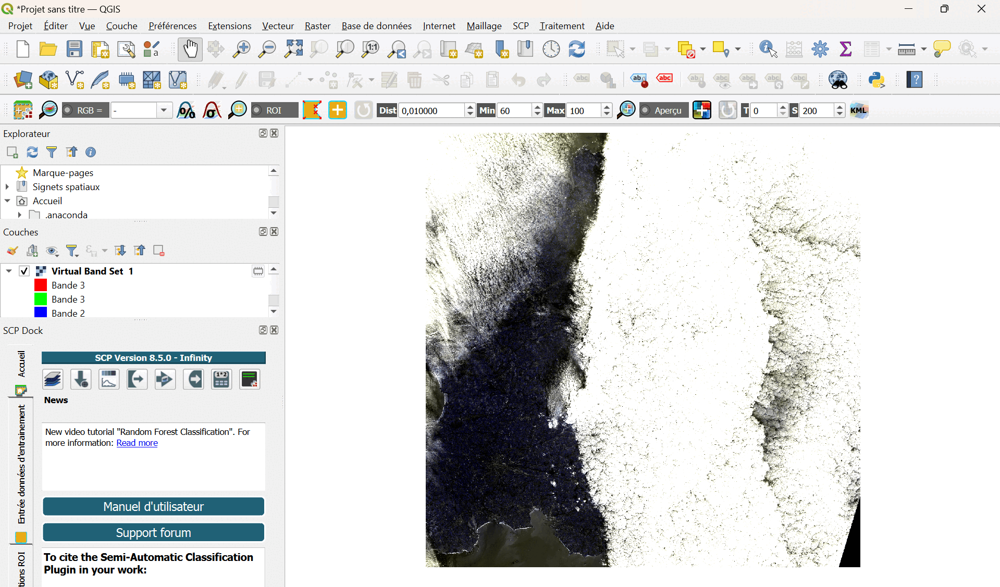

## Détermination de la surface d'un objet

Cette dernière partie du TD propose un exercice de plus haut niveau, qui fera appel aux différentes compétences que vous avez acquises lors des exercices précédents.
L'objectif est de déterminer la surface d'un objet dans une image "raster".
Il vous faudra réfléchir vous-même à la stratégie à appliquer et aux outils à utiliser, pour répondre à un problème.
Une fois cet exercice réussi, vous serez prêts à utiliser QGIS pour votre projet !

---

### Estimation de la courverture nuageuse

Chargez les fichiers "raster" du dossier "L2A_T30UVU_A035384_20231215T112402", pour 10 m de résolution, qui se trouvent dans le dossier "S2B_MSIL2A_20231215T112359_N0510_R037_T30UVU_20231215T130705.SAFE".

**Exercice :**

* Identifiez les données et les différentes bandes.

* Identifiez la région d'où proviennent ces données.

* Identifiez ce que vous observez.

* Trouvez une solution pour déterminer la surface couverte par les nuages.

